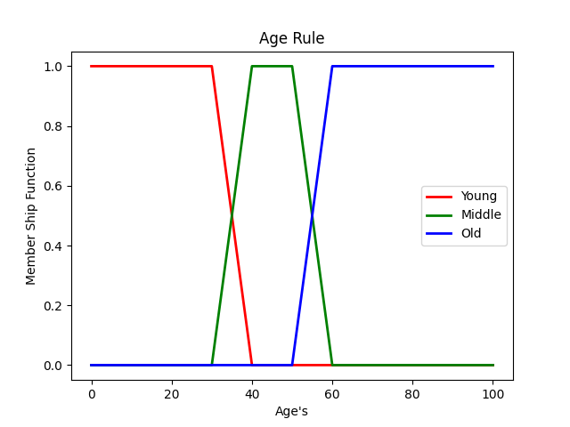

# Heart Diagnosis
This Fuzzy Logic In this study, a fuzzy system was designed to determine the risk of heart disease.
The system consists of _**24 rule bases**_ and has a **MISO** (Multi Input Single Output) 
system structure consisting of **_`6 inputs`_** - single outputs. 
Input values of the person; age, blood pressure, cholesterol, blood sugar, LDL and HDL values. 
The output value consists of the “**_`risk`_**” Fuzzy extraction engine and the center of gravity rinser.
The risk of heart disease is calculated by applying the necessary procedures to the information received from the user.

### The Rules Table

### Inputs

### Risk 

#### Test System

 **I tried our model with these data 👇 and It calculated Coroner Heart Diagnosis value is 3.5 .
 So in this example, this people has no risk for Coroner Heart Disease.**

 
 
**These Defuzzification are relative to the previous inputs 👆**

 

### Represent crisp and sense something _As Figure_
 